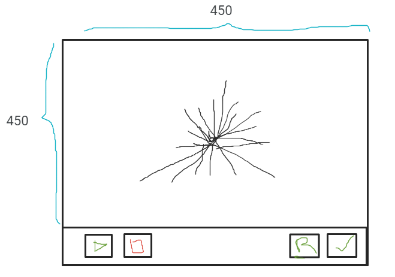

# Trabajo Practico 1

Hacer una aplicacion de escritorio
con la siguiente vista:

## Funciones

* Boton R: El boton R (reset) crea la imagen
inicial a aprtir de un arreglo de 200 enteros.
* Boton play: Comienza la animacion para
ordenar el arreglo
* Boton stop: Detiene la animacion
* Boton Check: Revisa si el arreglo esta
ordenado.

## Arreglo

El arreglo es una lista de 200 enteros.
Los valores van de 1 a 200 sin repetir.
Al dibujar, cada entero del arreglo es
una linea que sale del centro de la imagen
hacia afuera con una altura igual al
valor del entero.
El proximo numero se dibuja de igual manera
pero con una direccion diferente.