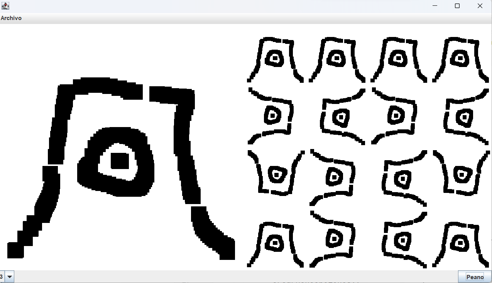

# Trabajo Practico 2

Consiste en implementar la imagen de Peano
de manera recursiva. Se debe presentar el
martes 12 de septiembre de 2023.

## Funciones

* La ventana debe tener dos paneles
* En un panel se debe poder dibujar libremente
* El otro panel muestra el resultado de Peano
* Se debe poder elegir la profundidad
* Se debe poder limpiar el panel de dibujo

A manera de ejemplo se puede ver una
propuesta de interfaz de usuario:


## Ayuda función recursiva
A modo de ayuda se presenta la siguiente
propuesta para la función recursiva de acuerdo
a lo que se vio en el curso:

```java
hacerPeano(x, y, dir, escala, matriz, n) 
si (n == 1)
    En x, y dibujar la imagen base
    achicada en escala veces
    aplicando la matriz de transformacion matriz (rotacion)
else
    escala *= 2
    // Para subfigura 1
    Matriz m con rotacion -90
    m2 = copia de matriz
    m2.componer(m)
    x1,y1,dir1 = obtenerReglaSubFigura1(dir)
    sf1x = x + x1 * imagenBase.getAncho() / escala
    sf1y = y + y1 * imagenBase.getAlto() / escala
    hacerPeano(sf1x, sf1y, dir1, escala, m2, n - 1)
```
Para evitar entramparse con cosas que no funcionen
lo mejor será programar tests en la misma aplicación
que les permitan tener confianza de las operaciones
que se está haciendo sobre la imagen.

## Obligatorios

* El practico debe implementar Observer 
* El practico debe implementar Logs
* La funcion para hacer el Peano es recursiva