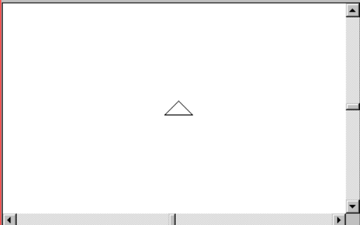

# Trabajo Practico 3

Consiste en implementar una tortuga que dibuje
de acuerdo a comandos en nuestra pantalla. 
El único problema es que los comandos son enviados
por red. Se debe presentar el viernes 22 de septiembre de 2023.

## Funciones

* La ventana debe mostrar un panel donde se dibuje 
los píxeles que así haya marcado la tortuga.
* La cabeza de la tortuga también debe aparecer 
dibujada con la rotación correspondiente.
* La tortuga debe obedecer las ordenes que se
indiquen en el protocolo de comandos.

## Pantallas

A manera de ejemplo se puede ver una propuesta de
interfaz de usuario:

En algun lugar de la interfaz el usuario debe 
poder ver la información para poder conectarse
al programa y enviar comandos.

En algun lugar de la interfaz se debe indicar
la lista de comandos que el programa acepta y
puede recibir para poder manejar la tortuga.

## Protocolo

Un protocolo es una serie de comandos que dos
programas se ponen de acuerdo para poder colaborar
y comunicarse operaciones que uno y otro deben 
realizar. En el caso de la tortuga, las operaciones
que se deben implementar son las siguientes:

* PENUP: levanta el lápiz
* PENDOWN: baja el lápiz
* FORWARD x: avanza una cantidad x de pixeles. El
número x debe ser un entero positivo.
* BACKWARD x: retrocede una cantidad x de pixeles. El
número x debe ser un entero positivo.
* RIGHT x: gira a la derecha x grados. El número x
debe ser un entero positivo entre 0 y 360.
* LEFT x: gira a la izquierda x grados. El número x
debe ser un entero positivo entre 0 y 360.
* COLOR x: cambia el color de la tortuga. El número
x debe ser un entero positivo en hexadecimal en la
forma 0xRRGGBB.