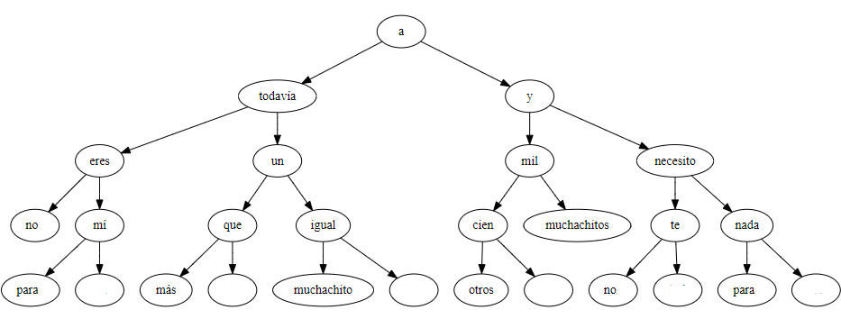

# Trabajo Practico 5

Consiste en mostrar un arbol a partir de una frase cualquiera. 
Se debe presentar el práctico hasta el martes **23 de octubre de 2023**.

## Funciones

* El panel principal de la aplicación es un panel de dibujo 
donde debe aparecer el arbol. 
* En la parte de abajo existe un campo de texto, de lectura
solamente, donde se puede
ver la frase formada a partir de recorrer todos los nodos del 
arbol en el orden correcto.
* En la parte de arriba se tiene un campo de texto editable 
con un botón al final de la derecha que dice "Hacer arbol".
* El usuario puede escribir cualquier frase en el campo de 
texto superior y al presionar el botón "Hacer arbol" se
debe mostrar el arbol correspondiente en el panel de dibujo
y la frase correspondiente en el campo de texto inferior.
* El nodo raiz debe contener la palabra correspondiente a la
mitad de la frase. Es decir, si la frase tiene 19 palabras 
la raiz será la palabra numero 10. Y así sucesivamente con 
las subfrases izquierda y derecha que deriven.

## Ejemplo

Para el siguiente ejemplo tomaremos la frase:

> no eres para mí todavía más que un muchachito igual a otros cien mil muchachitos y no te necesito para nada

Tendría el siguiente árbol:

El orden para leer recursivamente es siempre el mismo:

1. Se lee la frase de la izquierda
2. Se lee la raiz
3. Se lee la frase de la derecha

Por lo tanto la frase que se debe mostrar en el campo de texto
inferior es:

> no eres para mí todavía más que un muchachito igual a otros cien mil muchachitos y no te necesito para nada

Que debería ser igual a la frase anterior. Tomar en cuenta
posibles validaciones para que se pueda comparar la frase
de entrada (espacios entre palabras :-)

